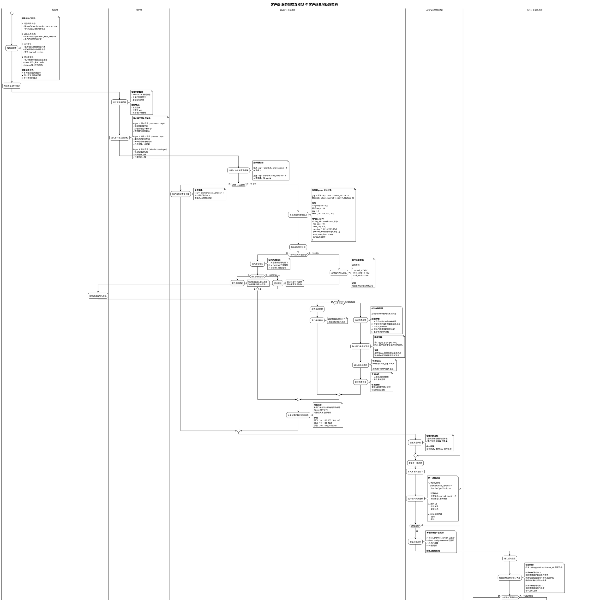

---

## 架构说明文档

### 一、服务端职责

**核心职责：**
1. **记录同步状态**：`DeviceSubscription.last_sync_version` - 每个设备的消息同步进度
2. **记录红点状态**：`UserSubscription.last_read_version` - 用户的消息已读进度
3. **推送变化**：推送有新消息的频道列表和消息数据，携带 `channel_version`
4. **提供数据源**：Redis 缓存（最新150条）、MongoDB（历史消息）

**服务端不负责：**
- ❌ 不构建完整消息副本
- ❌ 不处理消息顺序问题
- ❌ 不计算实时红点

---

### 二、客户端职责

**核心职责：**
根据服务端提供的数据，构建本地正确完整的消息副本。

---

### 三、客户端三层处理架构

#### **Layer 1: 预处理层 (PreProcess Layer) - 滑动窗口**

**职责：**
- 处理消息乱序和 gap
- 缓冲不连续的消息
- 等待缺失消息到达
- 超时主动拉取

**数据结构：**
```javascript
sliding_window[channel_id] = {
  min_seq: 101,                  // 缺失的最小 seq
  max_seq: 105,                  // 当前最大 seq
  missing: [101, 102, 103, 104], // 缺失列表
  pending_messages: {
    105: {...}                   // 已收到的消息
  },
  wait_start_time: now(),
  timeout: 5000                  // 5秒超时
}
```

**处理流程：**
1. 检查消息连续性
2. 连续 → 标记可直接处理
3. 不连续 → 进入滑动窗口，等待/拉取缺失消息
4. 窗口头部稳定 → 取出所有连续消息
5. 统一送入 Layer 2 处理

---

#### **Layer 2: 消息处理层 (Process Layer) - 本地消息副本**

**职责：**
- 存储本地消息副本
- 执行统一的消息消费逻辑
- 计算红点
- 更新 UI

**统一消费逻辑：**
```javascript
// 无论消息来自推送还是滑动窗口，都执行相同逻辑
function processMessage(message) {
  // 1. 更新版本号
  client.channel_version++;
  client.lastSyncVersion++;

  // 2. 计算红点
  if (message.msg_type === 'normal') {
    unread_count += 1;
  } else if (message.msg_type === 'recall') {
    unread_count = recalculateFromDB();
  }

  // 3. 更新 UI
  displayMessage(message);
  updateRedDot(unread_count);

  // 4. 触发业务逻辑
  triggerNotification();
}
```

**关键特性：**
- 接收单条或批量消息队列
- 消息连续 → 单条直接处理
- 窗口稳定 → 批量取出连续消息处理
- 所有消息都经过统一消费逻辑
- 无重复处理分支

---

#### **Layer 3: 后处理层 (AfterProcess Layer) - 待上报队列**

**职责：**
- 管理待上报会话队列
- 上报同步进度到服务端
- 上报已读状态到服务端
- 处理上报失败重试

**数据结构：**
```javascript
pending_reports[channel_id] = {
  channel_id: "AB",
  channel_version: 105,
  last_read_version: 100,
  last_sync_version: 105,
  report_type: "sync_only",
  retry_count: 0,
  last_attempt: now(),
  waiting_for_window: false  // 是否等待滑动窗口稳定
}
```

**上报策略：**
1. **检查滑动窗口**：
   - 有窗口 → 归并到待上报队列，等待窗口稳定
   - 无窗口 → 立即上报

2. **归并上报**：
   - 同一频道的多次变更归并为一次上报
   - 避免频繁上报

3. **失败重试**：
   - 延迟2秒，最多3次
   - 持久化到本地数据库
   - 触发时机：定时重试、下次登录

---

### 四、数据流转路径

#### **路径1：消息连续（快速路径）**
```
服务端推送 → Layer 1 (检查连续性，标记可处理) → Layer 2 (单条处理)
→ Layer 3 (检查窗口，无窗口则上报)
```

#### **路径2：消息不连续（滑动窗口路径）**
```
服务端推送 → Layer 1 (进入滑动窗口) → 等待/拉取缺失消息
→ Layer 1 (窗口稳定，取出连续消息) → Layer 2 (批量处理)
→ Layer 3 (检查窗口，有窗口则归并等待，无窗口则上报)
```

#### **路径3：窗口归并上报**
```
Layer 2 处理完成 → Layer 3 (发现有窗口，归并到待上报队列)
→ 等待窗口清空 → Layer 3 (窗口稳定，统一上报)
```

---

### 五、关键设计原则

1. **服务端提供数据，客户端构建副本**
   - 职责清晰分离
   - 客户端处理复杂度

2. **三层架构，单向流动**
   - Layer 1 → Layer 2 → Layer 3
   - 逐层推进，不回退

3. **统一消费逻辑**
   - Layer 2 统一处理所有消息
   - 无论来源（直接/窗口），都经过相同处理
   - 无重复处理分支
   - 保证一致性

4. **消息处理后再上报**
   - Layer 2 处理完成后进入 Layer 3
   - 检查滑动窗口状态决定上报时机
   - 确保状态最终一致

5. **滑动窗口稳定后送出**
   - 窗口头部连续才稳定
   - 取出所有连续消息统一送入 Layer 2
   - 保证消息顺序

6. **归并上报机制**
   - 检查频道是否有滑动窗口
   - 有窗口 → 归并等待
   - 无窗口 → 立即上报
   - 避免频繁上报，减少网络开销

7. **5秒超时保护**
   - 防止无限等待
   - 主动拉取补齐
   - 拉取失败时降级处理：展示最新消息并等待网络恢复
