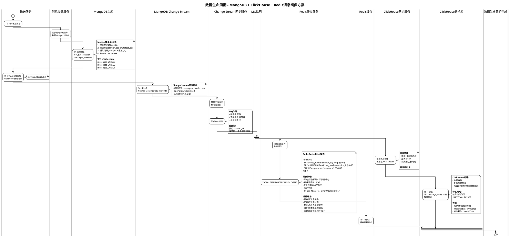

```plantuml
@startuml 数据生命周期V5-MongoDB+ClickHouse+Redis
!theme plain

title 数据生命周期 - MongoDB + ClickHouse + Redis消息镜像方案

|推送服务|

start

:T0: 用户发送消息;

|消息存储服务|

:同步调用存储服务
执行MongoDB事务;

|MongoDB主库|

:T0: 消息写入
写入当月collection
messages_YYYYMM;
note right
    <b>MongoDB事务操作:</b>
    1. 检查并创建Session
    2. 检查并创建UserSessionState(私聊)
    3. 插入消息(MongoDB生成_id)
    4. Session.version++

    <b>按月分collection:</b>
    messages_202503
    messages_202502
    messages_202501
end note

|推送服务|

:T0+50ms: 存储完成
WebSocket推送消息;
note right
    推送给会话在线成员
end note

|MongoDB Change Stream|

:T0+毫秒级:
Change Stream监听到insert事件;
note right
    <b>Change Stream同步服务:</b>
    - 监听所有 messages_* collection
    - operationType: insert
    - 实时捕获消息变更
end note

|Change Stream同步服务|

:转换文档格式
标准化消息;

:发送到MQ队列;
note right
    <b>MQ作用:</b>
    - 解耦上下游
    - 支持多个消费者
    - 消息持久化

    <b>分区键:</b>
    使用 session_id
    保证同一会话消息顺序
end note

|MQ队列|

fork

    |Redis缓存服务|

    :消费消息事件
    构建缓存;

    :ZADD + ZREMRANGEBYRANK + EXPIRE;
    note right
        <b>Redis Sorted Set 操作:</b>

        PIPELINE
          ZADD msg_cache:{session_id} {seq} {json}
          ZREMRANGEBYRANK msg_cache:{session_id} 0 -151
          EXPIRE msg_cache:{session_id} 604800
        EXEC

        <b>缓存策略:</b>
        - 所有会话(私聊+群聊)都缓存
        - 只保留最新150条
        - 7天过期(604800秒)
        - 实时更新
        - 以 seq 为 score，支持序号区间查询 ✅

        <b>设计理念:</b>
        - 缓存是消息镜像
        - 不维护消息状态
        - 撤回消息也正常缓存
        - 客户端本地处理状态
        - 支持按序号区间补档 ✅
    end note

    |Redis缓存|

    :T0+100ms:
    缓存更新完成;

fork again

    |ClickHouse同步服务|

    :消费消息事件
    批量写入ClickHouse;
    note right
        <b>批量策略:</b>
        - 累积1000条消息
        - 或等待1秒
        - 以先到达者为准

        <b>提升吞吐量</b>
    end note

    |ClickHouse分析库|

    :T0+1-3秒:
    写入message_analytics表
    按月分区;
    note right
        <b>ClickHouse用途:</b>
        - 合规查询
        - 复杂条件搜索
        - 按公司/类型/时间组合查询

        <b>分区策略:</b>
        按月自动分区
        PARTITION 202503

        <b>性能:</b>
        - 列存储+压缩(10:1)
        - TTL自动删除10年前数据
        - 查询耗时: 200-500ms
    end note

end fork

|数据生命周期完成|

stop

@enduml
```
