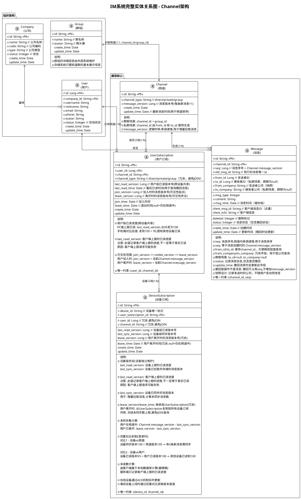

```plantuml
@startuml 完整实体关系图-IM系统
!theme plain
skinparam linetype ortho

title IM系统完整实体关系图 - Channel架构

' ============ 组织架构实体 ============
package "组织架构" {
  entity "Company\n(公司)" as Company {
    * id: String <<PK>>
    --
    * name: String // 公司名称
    * code: String // 公司编码
    * type: String // 公司类型
    * status: Integer // 状态
    create_time: Date
    update_time: Date
  }

  entity "User\n(用户)" as User {
    * id: Long <<PK>>
    --
    * company_id: String <<FK>>
    * username: String
    * nickname: String
    * email: String
    * phone: String
    * avatar: String
    * status: Integer // 在线状态
    create_time: Date
    update_time: Date
  }

  entity "Group\n(群组)" as Group {
    * id: String <<PK>>
    --
    * name: String // 群名称
    * avatar: String // 群头像
    create_time: Date
    update_time: Date
    --
    说明:
    - 群组的详细信息由外部系统维护
    - 存储系统只需知道群的基本展示信息
  }
}

' ============ 通信核心实体 ============
package "通信核心" {
  entity "Channel\n(频道)" as Channel {
    * id: String <<PK>>
    --
    * channel_type: String // direct/private/group
    * message_version: Long // 消息版本号(每条新消息+1)
    create_time: Date
    update_time: Date // 最新消息时间(用于频道排序)
    --
    说明:
    - 群聊场景: channel_id = group_id
    - 私聊场景: channel_id 由 from_id 和 to_id 推导生成
    - message_version: 逻辑时钟,单调递增,用于增量拉取消息
  }

  entity "UserSubscription\n(用户订阅)" as UserSubscription {
    * id: String <<PK>>
    --
    * user_id: Long <<FK>>
    * channel_id: String <<FK>>
    * channel_type: String // direct/private/group（冗余，避免JOIN）
    --
    last_read_version: Long // 用户级已读版本号(跨设备共享)
    last_read_time: Date // 最后已读时间(用于查询撤回消息)
    join_version: Long // 加入时的消息版本号(可见性起点)
    leave_version: Long // 离开时的消息版本号(可见性终点)
    --
    join_time: Date // 加入时间
    leave_time: Date // 退出时间(null=仍在频道中)
    create_time: Date
    update_time: Date
    --
    说明:
    - 用户级已读进度(跨设备共享):
      PC端上报已读: last_read_version 从95变为100
      手机端对比此值: 发现100 > 95,感知其他设备已读

    - last_read_version: 客户端上报的已读进度
      注意: 此值记录客户端上报的进度,不一定等于真实已读
      原因: 客户端上报请求可能失败

    - 可见性范围: join_version <= visible_version <= leave_version
      用户加入时: join_version = 当前Channel.message_version
      用户离开时: leave_version = 当前Channel.message_version

    - 唯一约束: (user_id, channel_id)
  }

  entity "DeviceSubscription\n(设备订阅)" as DeviceSubscription {
    * id: String <<PK>>
    --
    * device_id: String // 设备唯一标识
    * user_subscription_id: String <<FK>>
    --
    * user_id: Long // 冗余,避免JOIN
    * channel_id: String // 冗余,避免JOIN
    --
    last_read_version: Long // 设备级已读版本号
    last_sync_version: Long // 设备级同步版本号
    leave_version: Long // 用户离开时的消息版本号(冗余)
    --
    leave_time: Date // 用户离开时间(冗余,null=仍在频道中)
    create_time: Date
    update_time: Date
    --
    说明:
    - 设备级状态(设备独立维护):
      last_read_version: 设备上报的已读进度
      last_sync_version: 设备已拉取并存储的消息版本

    - last_read_version: 客户端上报的已读进度
      注意: 此值记录客户端上报的进度,不一定等于真实已读
      原因: 客户端上报请求可能失败

    - last_sync_version: 设备已同步的消息版本
      用于: 增量拉取消息,计算未同步消息数

    - leave_version/leave_time: 继承自UserSubscription(冗余)
      用户离开时: 从UserSubscription复制到所有设备订阅
      作用: 冻结未同步数上限,避免JOIN查询

    - 未同步数计算:
      用户在频道中: Channel.message_version - last_sync_version
      用户已离开: leave_version - last_sync_version

    - 双重对比机制(登录时):
      对比1 - 设备vs频道:
        设备同步版本100 < 频道版本105 → 有5条新消息需同步

      对比2 - 设备vs用户:
        设备已读版本95 < 用户已读版本100 → 其他设备已读到100

    - 未读数计算:
      由客户端基于本地数据库计算(最精确)
      服务端只记录客户端上报的已读进度

    - 在线设备通过ACK机制实时更新
    - 离线设备上线时通过双重对比获取版本差值

    - 唯一约束: (device_id, channel_id)
  }

  entity "Message\n(消息)" as Message {
    * id: String <<PK>>
    --
    * channel_id: String <<FK>>
    * seq: Long // 消息序号 = Channel.message_version
    * old_msg_id: String // 现行的消息唯一id
    --
    * from_id: Long // 发送者ID
    * to_id: Long // 接收者ID（私聊场景，群聊为null）
    * from_company: String // 发送者公司（快照）
    * to_company: String // 接收者公司（私聊场景，群聊为null）
    --
    * msg_type: Integer
    * content: String
    * msg_time: Date // 消息时间（毫秒级）
    --
    client_msg_id: String // 客户端消息ID（去重）
    client_info: String // 客户端信息
    --
    deleted: Integer // 删除标记
    status: Integer // 消息状态（包含撤回状态）
    --
    create_time: Date // 创建时间
    update_time: Date // 更新时间（撤回时会更新）
    --
    说明:
    - seq: 消息序号,频道内单调递增,用于消息排序
    - seq: 等于消息创建时的 Channel.message_version
    - from_id/to_id: 推导channel_id，方便微观层面查询
    - from_company/to_company: 冗余字段，用于按公司查询
    - 群聊场景: to_id=null, to_company=null
    - status: 记录消息状态,包含是否撤回
    - update_time: 撤回消息时会更新此字段
    - 撤回是操作不是消息: 撤回不占用seq,不增加message_version
    - 快照设计: 记录发送时的公司，不随用户变动而改变
    - 唯一约束: (channel_id, seq)
  }
}

' ============ 关系定义 ============

' 组织架构关系
Company ||--o{ User : "雇用"

' 通信关系
Group ||--|| Channel : "关联频道(1:1, channel_id=group_id)"
User ||--o{ UserSubscription : "订阅频道(1:N)"
Channel ||--o{ UserSubscription : "成员订阅(1:N)"
UserSubscription ||--o{ DeviceSubscription : "设备订阅(1:N)"
User ||--o{ Message : "发送"
Channel ||--o{ Message : "包含(1:N)"
@enduml
```
