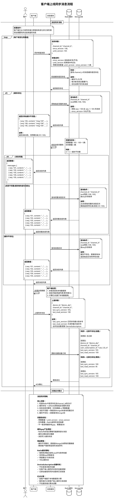

```plantuml
@startuml 客户端上线同步消息流程
!theme plain
skinparam backgroundColor #FFFFFF
skinparam handwritten false
skinparam defaultFontSize 13
skinparam arrowThickness 2

title 客户端上线同步消息流程

actor 用户 as User
participant "客户端" as Client
participant "消息服务" as MessageService
database "Redis缓存" as Redis
database "MongoDB" as MongoDB

== 消息同步流程 ==

note over Client
  <b>前置条件：</b>
  客户端已从订阅同步接口获取到有变化的订阅列表
  现在需要同步这些频道的消息
end note

loop 每个有变化的频道

  Client -> MessageService: 同步频道消息
  note right
    <b>请求参数：</b>
    {
      channel_id: "channel_A",
      since_version: 100,
      until_version: 105
    }

    <b>参数说明：</b>
    - since_version: 起始版本号(不含)
    - until_version: 结束版本号(含)
    - 预期消息数量: until_version - since_version = 5条
  end note

  MessageService -> Redis: 检查缓存是否存在
  note right
    <b>检查：</b>
    查询 channel_A 的消息缓存是否存在

    <b>说明：</b>
    - 缓存TTL为7天
    - 每次新消息会重置TTL
    - 存在说明7天内有消息
  end note

  Redis --> MessageService: 返回是否存在

  alt 缓存存在

    MessageService -> Redis: 获取指定范围的消息
    note right
      <b>查询条件：</b>
      channel_id: "channel_A"
      seq范围: (100, 105]

      <b>说明：</b>
      - 获取 seq > 100 且 seq <= 105 的消息
      - since_version=100(不含)
    end note

    Redis --> MessageService: 返回消息列表
    note left
      <b>返回示例(缓存不完整)：</b>
      [
        { seq: 103, content: "msg 103", ... },
        { seq: 104, content: "msg 104", ... },
        { seq: 105, content: "msg 105", ... }
      ]

      <b>说明：</b>
      返回3条消息，但预期5条(101-105)
    end note

    MessageService -> MessageService: 校验消息完整性
    note right
      <b>完整性校验：</b>
      预期数量: 105 - 100 = 5条
      实际数量: 3条

      <b>判断：</b>
      3 < 5 → 缓存不完整
    end note

    alt 消息完整

      MessageService --> Client: 返回消息列表
      note left
        <b>返回数据：</b>
        {
          messages: [
            { seq: 101, content: "...", ... },
            { seq: 102, content: "...", ... },
            { seq: 103, content: "...", ... },
            { seq: 104, content: "...", ... },
            { seq: 105, content: "...", ... }
          ]
        }
      end note

    else 消息不完整(缓存缺失部分消息)

      MessageService -> MongoDB: 查询完整消息区间
      note right
        <b>查询条件：</b>
        channel_id: "channel_A"
        seq范围: (100, 105]
        按seq升序排序

        <b>说明：</b>
        从DB获取完整的消息区间
        确保返回所有5条消息(101-105)
      end note

      MongoDB --> MessageService: 返回完整消息列表
      note left
        <b>返回数据：</b>
        [
          { seq: 101, content: "...", ... },
          { seq: 102, content: "...", ... },
          { seq: 103, content: "...", ... },
          { seq: 104, content: "...", ... },
          { seq: 105, content: "...", ... }
        ]
      end note

      MessageService --> Client: 返回完整消息列表

    end

  else 缓存不存在

    MessageService -> MongoDB: 查询消息区间
    note right
      <b>查询条件：</b>
      channel_id: "channel_A"
      seq范围: (100, 105]
      按seq升序排序

      <b>说明：</b>
      缓存不存在，直接查询DB
      返回指定区间的所有消息
    end note

    MongoDB --> MessageService: 返回消息列表
    note left
      <b>返回数据：</b>
      [
        { seq: 101, content: "...", ... },
        { seq: 102, content: "...", ... },
        { seq: 103, content: "...", ... },
        { seq: 104, content: "...", ... },
        { seq: 105, content: "...", ... }
      ]
    end note

    MessageService --> Client: 返回消息列表

  end

  Client -> Client: 处理消息数据
  note right
    <b>客户端处理：</b>
    1. 存储消息到本地数据库
    2. 渲染页面(频道列表/聊天窗口)
    3. 计算红点(基于本地数据库)
  end note

  Client -> MessageService: 上报同步状态
  note right
    <b>上报参数：</b>
    {
      device_id: "device_abc",
      channel_id: "channel_A",
      last_sync_version: 105,
      last_read_version: 100
    }

    <b>说明：</b>
    - last_sync_version: 已同步的最大版本号
    - last_read_version: 已读的最大版本号
    - 此时会创建/更新 DeviceSubscription
  end note

  MessageService -> MongoDB: 更新/创建设备订阅
  note right
    <b>场景1 - 记录不存在(创建)：</b>

    变更前: 无记录

    变更后:
    device_id: "device_abc"
    channel_id: "channel_A"
    user_subscription_id: "sub_123_A"
    last_sync_version: 105
    last_read_version: 100

    <b>场景2 - 记录已存在(更新)：</b>

    变更前:
    last_sync_version: 100
    last_read_version: 95

    变更后:
    last_sync_version: 105
    last_read_version: 100
  end note

  MongoDB --> MessageService: 更新成功
  MessageService --> Client: ACK确认

end

== 关键设计要点 ==

note over Client, MongoDB
  <b>消息同步策略</b>

  <b>核心流程：</b>
  1. 检查Redis中是否存在该channel_id的ZSET
  2. 缓存存在 → 从Redis获取指定范围的消息
  3. 校验消息完整性（实际数量 vs 预期数量）
  4. 消息不完整 → 降级到MongoDB查询完整区间
  5. 缓存不存在 → 直接查询MongoDB

  <b>完整性校验：</b>
  - 预期数量 = until_version - since_version
  - 实际数量 = Redis返回的消息条数
  - 不一致说明缓存有gap，需要查DB

  <b>缓存gap产生原因：</b>
  - Redis内存淘汰策略可能删除部分消息
  - 缓存过期后部分重建
  - 消息写入缓存失败

  <b>降级策略：</b>
  - 缓存不完整时，直接查MongoDB获取完整数据
  - 确保客户端获得连续的消息序列

  <b>Redis缓存策略：</b>
  ✅ 使用有序集合结构,seq作为排序依据
  ✅ 支持按seq范围查询
  ✅ 保留最近150条消息
  ✅ 7天过期时间

  <b>DeviceSubscription创建时机：</b>
  ✅ 不在登录流程中创建
  ✅ 在客户端上报同步状态时创建/更新
  ✅ 记录设备级的同步进度和已读进度

  <b>红点计算：</b>
  ✅ 由客户端基于本地数据库计算
  ✅ 服务端只记录客户端上报的已读进度
  ✅ 不在服务端计算未读数
end note

@enduml
```
