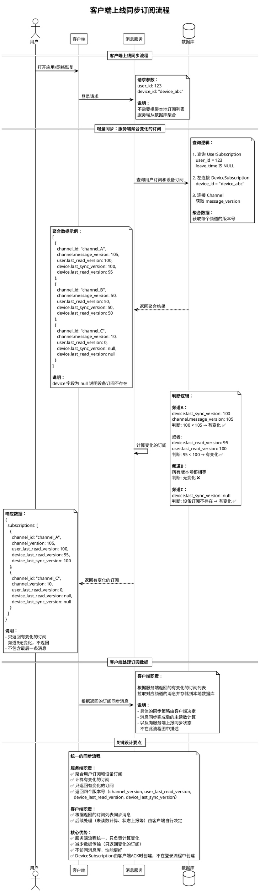

```plantuml
@startuml 客户端上线同步订阅流程
!theme plain
skinparam backgroundColor #FFFFFF
skinparam handwritten false
skinparam defaultFontSize 13
skinparam arrowThickness 2

title 客户端上线同步订阅流程

actor 用户 as User
participant "客户端" as Client
participant "消息服务" as MessageService
database "数据库" as DB

== 客户端上线同步流程 ==

User -> Client: 打开应用/网络恢复

Client -> MessageService: 登录请求
  note right
    <b>请求参数：</b>
    user_id: 123
    device_id: "device_abc"

    <b>说明：</b>
    不需要携带本地订阅列表
    服务端从数据库聚合
  end note

  == 增量同步：服务端聚合变化的订阅 ==

MessageService -> DB: 查询用户订阅和设备订阅
note right
  <b>查询逻辑：</b>

  1. 查询 UserSubscription
     user_id = 123
     leave_time IS NULL

  2. 左连接 DeviceSubscription
     device_id = "device_abc"

  3. 连接 Channel
     获取 message_version

  <b>聚合数据：</b>
  获取每个频道的版本号
end note

DB --> MessageService: 返回聚合结果
note left
  <b>聚合数据示例：</b>
  [
    {
      channel_id: "channel_A",
      channel.message_version: 105,
      user.last_read_version: 100,
      device.last_sync_version: 100,
      device.last_read_version: 95
    },
    {
      channel_id: "channel_B",
      channel.message_version: 50,
      user.last_read_version: 50,
      device.last_sync_version: 50,
      device.last_read_version: 50
    },
    {
      channel_id: "channel_C",
      channel.message_version: 10,
      user.last_read_version: 0,
      device.last_sync_version: null,
      device.last_read_version: null
    }
  ]

  <b>说明：</b>
  device 字段为 null 说明设备订阅不存在
end note

MessageService -> MessageService: 计算变化的订阅
note right
  <b>判断逻辑：</b>

  <b>频道A：</b>
  device.last_sync_version: 100
  channel.message_version: 105
  判断: 100 < 105 → 有变化 ✅

  或者:
  device.last_read_version: 95
  user.last_read_version: 100
  判断: 95 < 100 → 有变化 ✅

  <b>频道B：</b>
  所有版本号都相等
  判断: 无变化 ❌

  <b>频道C：</b>
  device.last_sync_version: null
  判断: 设备订阅不存在 → 有变化 ✅
end note

MessageService --> Client: 返回有变化的订阅
note left
  <b>响应数据：</b>
  {
    subscriptions: [
      {
        channel_id: "channel_A",
        channel_version: 105,
        user_last_read_version: 100,
        device_last_read_version: 95,
        device_last_sync_version: 100
      },
      {
        channel_id: "channel_C",
        channel_version: 10,
        user_last_read_version: 0,
        device_last_read_version: null,
        device_last_sync_version: null
      }
    ]
  }

  <b>说明：</b>
  - 只返回有变化的订阅
  - 频道B无变化，不返回
  - 不包含最后一条消息
end note

== 客户端处理订阅数据 ==

Client -> MessageService: 根据返回的订阅同步消息
note right
  <b>客户端职责：</b>

  根据服务端返回的有变化的订阅列表
  拉取对应频道的消息并存储到本地数据库

  <b>说明：</b>
  - 具体的同步策略由客户端决定
  - 消息同步完成后的未读数计算
  - 以及向服务端上报同步状态
  - 不在此流程图中描述
end note

== 关键设计要点 ==

note over Client, DB
  <b>统一的同步流程</b>

  <b>服务端职责：</b>
  ✅ 聚合用户订阅和设备订阅
  ✅ 计算有变化的订阅
  ✅ 只返回有变化的订阅
  ✅ 返回四个版本号（channel_version, user_last_read_version,
     device_last_read_version, device_last_sync_version）

  <b>客户端职责：</b>
  ✅ 根据返回的订阅列表同步消息
  ✅ 后续处理（未读数计算、状态上报等）由客户端自行决定

  <b>核心优势：</b>
  ✅ 服务端流程统一，只负责计算变化
  ✅ 减少数据传输（只返回变化的订阅）
  ✅ 不访问消息库，性能更好
  ✅ DeviceSubscription由客户端ACK时创建，不在登录流程中创建
end note

@enduml
```
