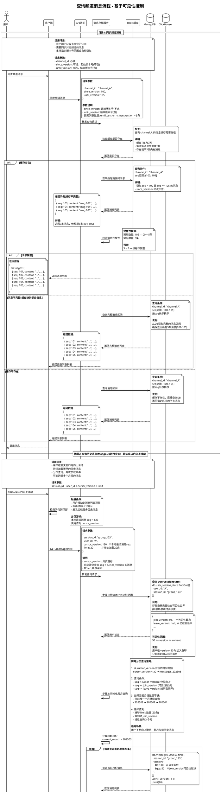

```plantuml
@startuml 查询消息流程
!theme plain
skinparam backgroundColor #FFFFFF
skinparam handwritten false
skinparam defaultFontSize 13
skinparam arrowThickness 2

title 查询频道消息流程 - 基于可见性控制

actor 用户 as User
participant "客户端" as Client
participant "API网关" as Gateway
participant "消息存储服务" as StorageSvc
participant "Redis缓存" as Redis
database "MongoDB" as MongoDB
database "ClickHouse" as ClickHouse

== 场景1: 同步频道消息 ==

note over User, MongoDB
  <b>适用场景:</b>
  - 客户端已获取有变化的订阅
  - 需要同步对应频道的消息
  - 支持指定版本号范围或自动获取

  <b>请求参数:</b>
  - channel_id: 必填
  - since_version: 可选，起始版本号(不含)
  - until_version: 可选，结束版本号(含)
end note

User -> Client: 同步频道消息

Client -> Gateway: 同步频道消息
note right
  <b>请求参数:</b>
  {
    channel_id: "channel_A",
    since_version: 100,
    until_version: 105
  }

  <b>参数说明:</b>
  - since_version: 起始版本号(不含)
  - until_version: 结束版本号(含)
  - 预期消息数量: until_version - since_version = 5条
end note

Gateway -> StorageSvc: 转发查询请求

StorageSvc -> Redis: 检查缓存是否存在
note right
  <b>检查:</b>
  查询 channel_A 的消息缓存是否存在

  <b>说明:</b>
  - 缓存TTL为7天
  - 每次新消息会重置TTL
  - 存在说明7天内有消息
end note

Redis --> StorageSvc: 返回是否存在

alt 缓存存在

  StorageSvc -> Redis: 获取指定范围的消息
  note right
    <b>查询条件:</b>
    channel_id: "channel_A"
    seq范围: (100, 105]

    <b>说明:</b>
    - 获取 seq > 100 且 seq <= 105 的消息
    - since_version=100(不含)
  end note

  Redis --> StorageSvc: 返回消息列表
  note left
    <b>返回示例(缓存不完整):</b>
    [
      { seq: 103, content: "msg 103", ... },
      { seq: 104, content: "msg 104", ... },
      { seq: 105, content: "msg 105", ... }
    ]

    <b>说明:</b>
    返回3条消息，但预期5条(101-105)
  end note

  StorageSvc -> StorageSvc: 校验消息完整性
  note right
    <b>完整性校验:</b>
    预期数量: 105 - 100 = 5条
    实际数量: 3条

    <b>判断:</b>
    3 < 5 → 缓存不完整
  end note

  alt 消息完整

    StorageSvc --> Client: 返回消息列表
    note left
      <b>返回数据:</b>
      {
        messages: [
          { seq: 101, content: "...", ... },
          { seq: 102, content: "...", ... },
          { seq: 103, content: "...", ... },
          { seq: 104, content: "...", ... },
          { seq: 105, content: "...", ... }
        ]
      }
    end note

  else 消息不完整(缓存缺失部分消息)

    StorageSvc -> MongoDB: 查询完整消息区间
    note right
      <b>查询条件:</b>
      channel_id: "channel_A"
      seq范围: (100, 105]
      按seq升序排序

      <b>说明:</b>
      从DB获取完整的消息区间
      确保返回所有5条消息(101-105)
    end note

    MongoDB --> StorageSvc: 返回完整消息列表
    note left
      <b>返回数据:</b>
      [
        { seq: 101, content: "...", ... },
        { seq: 102, content: "...", ... },
        { seq: 103, content: "...", ... },
        { seq: 104, content: "...", ... },
        { seq: 105, content: "...", ... }
      ]
    end note

    StorageSvc --> Client: 返回完整消息列表

  end

else 缓存不存在

  StorageSvc -> MongoDB: 查询消息区间
  note right
    <b>查询条件:</b>
    channel_id: "channel_A"
    seq范围: (100, 105]
    按seq升序排序

    <b>说明:</b>
    缓存不存在，直接查询DB
    返回指定区间的所有消息
  end note

  MongoDB --> StorageSvc: 返回消息列表
  note left
    <b>返回数据:</b>
    [
      { seq: 101, content: "...", ... },
      { seq: 102, content: "...", ... },
      { seq: 103, content: "...", ... },
      { seq: 104, content: "...", ... },
      { seq: 105, content: "...", ... }
    ]
  end note

  StorageSvc --> Client: 返回消息列表

end

Client --> User: 显示消息

== 场景2: 查询历史消息(MongoDB跨月查询) - 聊天窗口内向上滑动 ==

note over User, MongoDB
  <b>适用场景:</b>
  - 用户在聊天窗口内向上滑动
  - 持续加载更早的历史消息
  - 分页查询，每次加载20条
  - 可能跨越多个月份的消息

  <b>请求参数:</b>
  session_id + user_id + cursor_version + limit
end note

User -> Client: 在聊天窗口内向上滑动

Client -> Client: 检测滑动到顶部
note right
    <b>触发条件:</b>
    - 用户滑动到消息列表顶部
    - 距离顶部 < 100px
    - 触发加载更多历史消息

    <b>分页游标:</b>
    本地最旧消息 seq = 130
    使用作为 cursor_version
end note

Client -> Gateway: GET /messages/list
note right
    <b>请求参数:</b>
    {
      session_id: "group_123",
      user_id: "A",
      cursor_version: 130,  // 本地最旧消息seq
      limit: 20             // 每次加载20条
    }

    <b>说明:</b>
    - cursor_version: 分页游标
    - 向上滑动查询 seq < cursor_version 的消息
    - 按 seq 降序返回
end note

Gateway -> StorageSvc: 转发查询请求

StorageSvc -> MongoDB: 步骤1: 检查用户可见性范围
note right
    <b>查询 UserSessionState:</b>
    db.user_session_state.findOne({
      user_id: "A",
      session_id: "group_123"
    })

    <b>目的:</b>
    群聊场景需要检查可见性边界
    (私聊场景跳过此步骤)
end note

MongoDB --> StorageSvc: 返回用户状态
note right
    {
      join_version: 50,     // 可见性起点
      leave_version: null,  // 仍在会话中
      ...
    }

    <b>可见性范围:</b>
    50 <= version <= current

    <b>说明:</b>
    用户在 version=50 时加入群聊
    只能看到加入后的消息
end note

StorageSvc -> StorageSvc: 步骤2: 初始化跨月查询
note right
    <b>跨月分页查询策略:</b>

    1. 从 cursor_version 对应的月份开始
       cursor_version=130 → messages_202503

    2. 查询条件:
       - seq < cursor_version (分页向上)
       - seq >= join_version (可见性起点)
       - seq <= leave_version (如果已离开)

    3. 如果当前月份数量不够:
       - 往前推一个月继续查询
       - 202503 → 202502 → 202501

    4. 循环直到:
       - 凑够 limit 数量 (20条)
       - 或到达 join_version
       - 或已查询 3 个月

    <b>适用场景:</b>
    用户不断向上滑动，跨月加载历史消息
end note

StorageSvc -> StorageSvc: 计算起始月份\ncurrent_month = 202503

loop 循环查询直到凑够20条

    StorageSvc -> MongoDB: 查询当前月份消息
    note right
        db.messages_202503.find({
          session_id: "group_123",
          version: {
            $lt: 130,   // 分页条件
            $gte: 50    // join_version可见性起点
          }
        })
        .sort({ version: -1 })
        .limit(20)
    end note

    MongoDB --> StorageSvc: 返回消息列表

    alt 消息数量已够

        StorageSvc -> StorageSvc: 已凑够20条,结束循环

    else 消息数量不够且未达3个月限制

        StorageSvc -> StorageSvc: current_month -= 1
        note right
            往前推一个月
            202503 → 202502 → 202501

            继续查询直到:
            1. 凑够20条
            2. 到达join_version
            3. 查询了3个月
        end note

    end

end

note right of MongoDB
    <b>循环查询示例:</b>

    需要20条,cursor_version=130
    join_version=50

    第1次: 查询messages_202503
    - 查询范围: 50 <= version < 130
    - 返回15条 (version 129~115)
    - 不够,继续

    第2次: 查询messages_202502
    - 查询范围: 50 <= version < 115
    - 返回5条 (version 114~110)
    - 凑够20条,结束

    <b>可见性保障:</b>
    所有返回消息都满足 version >= join_version
end note

StorageSvc --> Client: 返回20条消息(10-20ms)
note right
    {
      messages: [
        {id: "msg129", version: 129, ...},
        {id: "msg128", version: 128, ...},
        ...
        {id: "msg110", version: 110, ...}
      ],
      has_more: true,
      next_cursor_version: 109,
      visibility_range: {
        min_version: 50,  // join_version
        max_version: null // 仍在会话中
      }
    }

    <b>客户端处理:</b>
    - 将20条消息插入本地消息列表顶部
    - 更新 UI，保持滚动位置
    - 更新 cursor_version = 109
end note

Client --> User: 在聊天窗口顶部显示历史消息

note over Client
  <b>用户继续向上滑动:</b>

  再次触发滑动加载
  cursor_version = 109
  继续查询更早的消息

  <b>循环往复:</b>
  用户可以不断向上滑动
  持续加载历史消息
  直到到达可见性边界 (join_version=50)
  或没有更多消息 (has_more=false)
end note

== 场景3: 根据公司+组合条件搜索会话(ClickHouse) ==

User -> Client: 搜索"公司A"最近3个月的文件消息

Client -> Gateway: POST /channels/search
note right
    参数:
    {
      user_id: "A",
      company_name: "公司A",
      msg_type: "file",
      date_range: {
        start: "2025-01-01",
        end: "2025-03-31"
      },
      limit: 50
    }
end note

Gateway -> StorageSvc: 转发搜索请求

StorageSvc -> StorageSvc: 识别复杂查询
note right
    检测到组合条件查询
    路由到ClickHouse
end note

StorageSvc -> ClickHouse: 聚合查询符合条件的会话
note right
    <b>SQL查询:</b>

    SELECT
        session_id,
        COUNT(*) as msg_count,
        MAX(msg_time) as last_msg_time,
        MAX(version) as last_version
    FROM message_analytics
    WHERE from_company = '公司A'
      AND msg_type = 'file'
      AND create_date >= '2025-01-01'
      AND create_date <= '2025-03-31'
      AND deleted = 0
    GROUP BY session_id
    ORDER BY last_msg_time DESC
    LIMIT 50;

    <b>目的:</b>
    聚合出包含符合条件消息的会话列表

    耗时: 200-500ms
end note

ClickHouse --> StorageSvc: 返回会话列表
note right
    返回50个会话:
    [
      {
        session_id: "group_123",
        msg_count: 25,
        last_msg_time: "2025-03-15 10:30:00",
        last_version: 180
      },
      {
        session_id: "s_AB",
        msg_count: 15,
        last_msg_time: "2025-03-10 14:20:00",
        last_version: 95
      },
      ...
    ]
end note

StorageSvc -> StorageSvc: 补充会话元信息
note right
    可选:
    - 查询会话名称/头像
    - 查询最后一条消息摘要
end note

StorageSvc --> Client: 返回会话列表(200-600ms)
note right
    {
      channels: [
        {
          session_id: "group_123",
          session_name: "技术交流群",
          msg_count: 25,
          last_msg_time: "2025-03-15 10:30:00"
        },
        {
          session_id: "s_AB",
          session_name: "用户B",
          msg_count: 15,
          last_msg_time: "2025-03-10 14:20:00"
        },
        ...
      ],
      total: 50
    }
end note

Client --> User: 显示符合条件的会话列表

...

User -> Client: 点击某个会话查看详细消息

Client -> Gateway: GET /messages/list
note right
    参数:
    {
      session_id: "group_123",
      user_id: "A",
      cursor_version: null,  // 首次查询
      limit: 20
    }
end note

Gateway -> StorageSvc: 转发查询请求

StorageSvc -> MongoDB: 步骤1: 获取用户可见性范围
note right
    <b>查询UserSessionState:</b>
    db.user_session_state.findOne({
      user_id: "A",
      session_id: "group_123"
    })

    <b>目的:</b>
    获取join_version和leave_version
    确定可见性边界
end note

MongoDB --> StorageSvc: 返回用户状态
note right
    {
      session_id: "group_123",
      join_version: 50,     // 可见性起点
      leave_version: 150,   // 可见性终点(已离开)
      last_read_version: 145
    }

    <b>可见性范围:</b>
    50 <= version <= 150
end note

StorageSvc -> MongoDB: 步骤2: 在可见性范围内查询消息
note right
    <b>查询消息(应用可见性过滤):</b>
    db.messages_202503.find({
      session_id: "group_123",
      version: {
        $gte: 50,   // join_version起点
        $lte: 150   // leave_version终点
      }
    })
    .sort({ version: -1 })
    .limit(20)

    <b>关键:</b>
    在数据库层面就过滤不可见消息
    只返回可见范围内的消息
end note

MongoDB --> StorageSvc: 返回消息列表
note right
    返回20条消息:
    version范围: 150~131
    (从leave_version开始往前取)
end note

StorageSvc --> Client: 返回消息列表(10-20ms)
note right
    {
      messages: [
        {id: "msg150", version: 150, ...},
        {id: "msg149", version: 149, ...},
        ...
        {id: "msg131", version: 131, ...}
      ],
      has_more: true,
      next_cursor_version: 130,
      visibility_range: {
        min_version: 50,   // join_version
        max_version: 150   // leave_version(已离开)
      }
    }
end note

Client --> User: 显示会话消息

== 总结 ==

note over User, ClickHouse
<b>三种查询场景总结:</b>

<b>场景1: 同步频道消息</b>
- 触发条件: 客户端已获取有变化的订阅
- 请求参数: channel_id + since_version + until_version
- 查询流程:
  1. 检查Redis缓存是否存在
  2. 缓存存在 → 获取指定范围的消息
  3. 校验消息完整性（实际数量 vs 预期数量）
  4. 消息不完整 → 降级MongoDB查询完整区间
  5. 缓存不存在 → 直接查询MongoDB
- 数据源: Redis Sorted Set (优先) → MongoDB (降级)
- 性能: Redis缓存完整 <5ms, MongoDB降级 10-20ms
- 完整性保障: 确保返回连续的消息序列

<b>场景2: 查询历史消息(MongoDB跨月查询)</b>
- 触发条件: 用户在聊天窗口内向上滑动到顶部
- 请求参数: session_id + user_id + cursor_version + limit
- 数据源: MongoDB按月分collection
- 查询策略: 跨月循环查询，最多3个月
  1. 从 cursor_version 对应月份开始
  2. 查询 seq < cursor_version 的消息
  3. 数量不够，往前推一个月继续
  4. 凑够 limit 数量或到达 join_version
- 可见性检查 (群聊):
  1. 查询 UserSessionState 获取 join_version
  2. 查询条件: join_version <= seq < cursor_version
  3. 只返回可见范围内的消息
- 性能: 10-20ms
- 适用: 聊天窗口内持续向上滑动加载历史消息

<b>场景3: 组合条件搜索会话(ClickHouse)</b>
- 阶段1: 聚合查询符合条件的会话
  - 数据源: ClickHouse分析表
  - 查询: 按条件聚合出session_id列表
  - 性能: 200-600ms
  - 返回: 会话列表(不含具体消息)
- 阶段2: 用户点击会话查看消息
  - 数据源: MongoDB
  - 可见性检查:
    1. 查询UserSessionState获取join_version和leave_version
    2. 查询条件: join_version <= version <= leave_version
    3. 在数据库层面应用可见性过滤
  - 性能: 10-20ms
  - 返回: 可见范围内的消息
- 适用: 按公司/类型/时间等组合条件搜索会话

<b>核心设计原则:</b>
✅ 场景1: 私聊场景不涉及可见性检查
✅ 场景2和3: 群聊场景需检查UserSubscription
✅ join_version控制可见性起点(后加入成员只能看加入后的消息)
✅ leave_version控制可见性终点(离开后的消息不可见)
✅ 可见性范围: join_version <= version <= leave_version
✅ 通过索引过滤,在数据库层面控制可见性
✅ 性能优于应用层后置过滤

<b>场景选择策略:</b>
✅ 同步频道消息 → 场景1 (Redis优先 → MongoDB降级)
✅ 历史消息查询 → 场景2 (MongoDB跨月查询)
✅ 复杂条件搜索 → 场景3 (ClickHouse聚合)

<b>Redis缓存优势:</b>
✅ 使用有序集合,seq作为score
✅ 支持按seq范围查询
✅ 完整性校验机制
✅ 降级策略保障数据完整性
end note

@enduml
```
