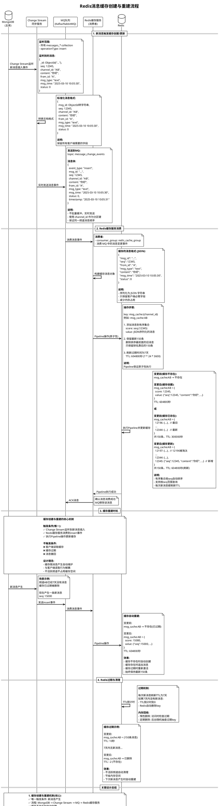

```plantuml
@startuml Redis消息缓存构建流程
!theme plain
skinparam backgroundColor #FFFFFF
skinparam handwritten false
skinparam defaultFontSize 13
skinparam arrowThickness 2

title Redis消息缓存创建与重建流程

database "MongoDB\n(主库)" as MongoDB
participant "Change Stream\n同步服务" as ChangeStream
participant "MQ队列\n(Kafka/RabbitMQ)" as MQ
participant "Redis缓存服务\n(消费者)" as CacheSvc
database "Redis" as Redis

== 1. 新消息触发缓存创建/更新 ==

MongoDB -> ChangeStream: Change Stream监听\n新消息插入事件
note right
  <b>监听范围:</b>
  - 所有 messages_* collection
  - operationType: insert

  <b>监听到的消息:</b>
  {
    _id: ObjectId("..."),
    seq: 12345,
    channel_id: "AB",
    content: "你好",
    from_id: "A",
    msg_type: "text",
    msg_time: "2025-03-10 10:05:30",
    status: 0
  }
end note

ChangeStream -> ChangeStream: 转换文档格式
note right
  <b>标准化消息格式:</b>
  {
    msg_id: ObjectId转字符串,
    seq: 12345,
    channel_id: "AB",
    content: "你好",
    from_id: "A",
    msg_type: "text",
    msg_time: "2025-03-10 10:05:30",
    status: 0
  }

  <b>说明:</b>
  保留所有客户端需要的字段
end note

ChangeStream -> MQ: 实时发送消息事件
note right
  <b>发送到MQ:</b>
  topic: message_change_events

  <b>消息体:</b>
  {
    event_type: "insert",
    msg_id: "...",
    seq: 12345,
    channel_id: "AB",
    content: "你好",
    from_id: "A",
    msg_type: "text",
    msg_time: "2025-03-10 10:05:30",
    status: 0,
    timestamp: "2025-03-10 10:05:31"
  }

  <b>说明:</b>
  - 不批量缓冲，实时发送
  - 使用 channel_id 作为分区键
  - 保证同一频道消息顺序
end note

== 2. Redis缓存服务消费 ==

MQ -> CacheSvc: 消费消息事件
note right
  <b>消费者:</b>
  - consumer_group: redis_cache_group
  - 消费 MQ 中的消息变更事件
end note

CacheSvc -> CacheSvc: 构建缓存消息对象
note right
  <b>缓存的消息格式 (JSON):</b>
  {
    "msg_id": "...",
    "seq": 12345,
    "from_id": "A",
    "msg_type": "text",
    "content": "你好",
    "msg_time": "2025-03-10 10:05:30",
    "status": 0
  }

  <b>说明:</b>
  - 序列化为 JSON 字符串
  - 只保留客户端必需字段
  - 减少内存占用
end note

CacheSvc -> Redis: Pipeline操作(原子性)
note right
  <b>操作步骤:</b>

  key: msg_cache:{channel_id}
  例如: msg_cache:AB

  1. 添加消息到有序集合
     score: seq (12345)
     value: JSON序列化的消息

  2. 保留最新150条
     删除排序最前面的旧消息
     只保留排名靠后的150条

  3. 刷新过期时间为7天
     TTL: 604800秒 (7 * 24 * 3600)

  <b>说明:</b>
  Pipeline保证原子性执行
end note

Redis -> Redis: 执行Pipeline并更新缓存
note right
  <b>变更前(缓存不存在):</b>
  msg_cache:AB → 不存在

  <b>变更后(缓存创建):</b>
  msg_cache:AB = {
    score: 12345,
    value: {"seq":12345, "content":"你好", ...}
  }
  TTL: 604800秒

  <b>或</b>

  <b>变更前(缓存已存在):</b>
  msg_cache:AB = {
    12196: {...},  // 最旧
    ...
    12344: {...}   // 最新
  }
  共150条，TTL: 300000秒

  <b>变更后(缓存更新):</b>
  msg_cache:AB = {
    12197: {...},  // 12196被淘汰
    ...
    12344: {...},
    12345: {"seq":12345, "content":"你好", ...}  // 新增
  }
  共150条，TTL: 604800秒(刷新)

  <b>说明:</b>
  - 有序集合按seq自动排序
  - 支持按seq范围查询
  - 每次新消息都刷新TTL
end note

Redis --> CacheSvc: Pipeline执行成功

CacheSvc -> MQ: ACK消息
note right
  确认消息消费成功
  MQ移除该消息
end note

== 3. 缓存重建时机 ==

note over MongoDB, Redis
  <b>缓存创建与重建的核心机制</b>

  <b>触发条件(唯一):</b>
  ✅ Change Stream监听到新消息插入
  ✅ Redis缓存服务消费到insert事件
  ✅ 执行Pipeline操作更新缓存

  <b>不触发条件:</b>
  ❌ 客户端读取缓存
  ❌ 缓存过期
  ❌ 消息撤回

  <b>设计理念:</b>
  - 缓存随消息产生自动维护
  - 与客户端读取行为解耦
  - 不活跃频道不占用缓存空间
end note

MongoDB -> ChangeStream: 新消息产生
note right
  <b>场景示例:</b>
  频道AB已经7天没有消息
  缓存已过期被删除

  现在产生一条新消息
  seq: 15000
end note

ChangeStream -> MQ: 发送insert事件

MQ -> CacheSvc: 消费消息事件

CacheSvc -> Redis: Pipeline操作
note right
  <b>缓存自动重建:</b>

  变更前:
  msg_cache:AB → 不存在(已过期)

  变更后:
  msg_cache:AB = {
    score: 15000,
    value: {"seq":15000, ...}
  }
  TTL: 604800秒

  <b>效果:</b>
  - 缓存不存在时自动创建
  - 缓存存在时追加消息
  - 缓存过期时重新激活
  - 始终保持最新150条
end note

== 4. Redis过期与清理 ==

Redis -> Redis: TTL倒计时
note right
  <b>过期机制:</b>

  每次新消息刷新TTL为7天
  如果7天内没有新消息:
  - TTL倒计时到0
  - Redis自动删除key

  <b>内存回收:</b>
  - 惰性删除: 访问时检查过期
  - 定期删除: 后台随机抽查过期key
end note

note over Redis
  <b>缓存过期示例:</b>

  变更前:
  msg_cache:AB = {150条消息}
  TTL: 10秒

  7天内无新消息...

  变更后:
  msg_cache:AB → 已删除
  TTL: -2 (不存在)

  <b>效果:</b>
  - 不活跃频道自动清理
  - 节省内存空间
  - 下次新消息产生时自动重建
end note

== 关键设计总结 ==

note over MongoDB, Redis
  <b>1. 缓存创建与重建机制(核心)</b>
  ✅ 唯一触发条件: 新消息产生
  ✅ 流程: MongoDB → Change Stream → MQ → Redis缓存服务
  ✅ 缓存不存在时自动创建
  ✅ 缓存存在时追加消息
  ✅ 缓存过期时重新激活
  ❌ 不在客户端读取时创建/重建
  ❌ 不在缓存过期时重建
  ❌ 不在消息撤回时重建

  <b>2. 数据结构</b>
  - 使用有序集合(Sorted Set)
  - score = seq(消息序号)
  - value = JSON序列化的消息
  - 自动按seq升序排列
  - 支持按seq范围查询

  <b>3. 容量控制</b>
  - 每次插入后保持最新150条
  - 自动淘汰seq最小的旧消息
  - 150条约15-30KB/频道

  <b>4. 过期时间管理</b>
  - 每次新消息刷新TTL为7天(604800秒)
  - 7天内有新消息: TTL持续刷新
  - 7天无新消息: 自动过期删除
  - 不活跃频道自动清理，节省内存

  <b>5. Pipeline原子操作</b>
  - 添加消息 + 保留150条 + 刷新TTL
  - 一次性原子执行
  - 避免并发问题
  - 保证数据一致性

  <b>6. 消息消费特点</b>
  - 实时消费(不批量缓冲)
  - 使用channel_id作为分区键
  - 保证同一频道消息顺序
  - 保证消息及时性

  <b>7. 设计理念</b>
  ✅ 缓存随消息产生自动维护
  ✅ 与客户端读取行为完全解耦
  ✅ 不活跃频道不占用缓存空间
  ✅ 简化缓存管理逻辑

  <b>8. 内存估算</b>
  - 单频道: 150条 ≈ 15-30KB
  - 10万活跃频道 ≈ 1.5-3GB
  - 100万活跃频道 ≈ 15-30GB
end note

@enduml
```
