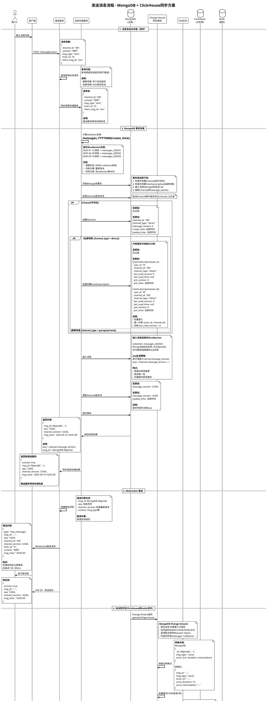

```plantuml
@startuml 发送消息流程V5-MongoDB同步方案
!theme plain
skinparam backgroundColor #FFFFFF
skinparam handwritten false
skinparam defaultFontSize 13
skinparam arrowThickness 2

title 发送消息流程 - MongoDB + ClickHouse同步方案

actor 用户A as Client
participant "客户端" as ClientApp
participant "推送服务" as PushSvc
participant "消息存储服务" as StorageSvc
database "MongoDB\n(主库)" as MongoDB
participant "Change Stream\n同步服务" as ChangeStream
participant "MQ队列" as MQ
database "ClickHouse\n(分析库)" as ClickHouse
database "Redis\n(缓存)" as Redis

== 1. 消息发送与存储（同步） ==

Client -> ClientApp: 输入消息内容
ClientApp -> PushSvc: POST /messages/send
note right
  <b>请求参数:</b>
  {
    channel_id: "AB",
    content: "你好",
    msg_type: "text",
    from_id: "A",
    client_msg_id: "xxx"
  }
end note

PushSvc -> PushSvc: 查询频道在线成员
note right
  <b>查询内容:</b>
  查询频道在线成员(用于推送)

  <b>说明:</b>
  - 群聊场景: 多个在线成员
  - 私聊场景: 对方是否在线
end note

PushSvc -> StorageSvc: 同步调用存储服务
note right
  <b>请求体:</b>
  {
    channel_id: "AB",
    content: "你好",
    msg_type: "text",
    from_id: "A",
    client_msg_id: "xxx"
  }

  <b>说明:</b>
  推送服务等待存储完成
end note

== 2. MongoDB 事务存储 ==

StorageSvc -> StorageSvc: 计算collection名称\n= messages_YYYYMM(create_time)

note right of StorageSvc
  <b>按月分collection示例:</b>
  2025-01-15消息 → messages_202501
  2025-02-20消息 → messages_202502
  2025-03-10消息 → messages_202503

  **优势:**
  ✅ 清理历史: DROP collection秒级
  ✅ 归档方便: 整表导出
  ✅ 冷热分离: 旧collection移HDD
end note

StorageSvc -> MongoDB: 开始MongoDB事务
note right
    <b>事务保证原子性:</b>
    1. 检查并创建Channel(如不存在)
    2. 检查并创建UserSubscription(私聊场景)
    3. 插入消息(MongoDB生成_id)
    4. 更新Channel的message_version
end note

StorageSvc -> MongoDB: 检查Channel是否存在
note right
  查询Channel表中是否存在channel_id记录
end note

alt Channel不存在

    StorageSvc -> MongoDB: 创建Channel
    note right
      <b>变更前:</b>
      无记录

      <b>变更后:</b>
      channel_id: "AB"
      channel_type: "direct"
      message_version: 0
      create_time: 当前时间
      update_time: 当前时间
    end note

    alt 私聊场景 (channel_type = direct)

        StorageSvc -> MongoDB: 批量创建UserSubscription
        note right
          <b>为频道双方初始化订阅:</b>

          <b>变更前:</b>
          无记录

          <b>变更后:</b>
          UserSubscription(user_A):
            user_id: "A"
            channel_id: "AB"
            channel_type: "direct"
            last_read_version: 0
            last_read_time: null
            join_version: 0
            join_time: 当前时间

          UserSubscription(user_B):
            user_id: "B"
            channel_id: "AB"
            channel_type: "direct"
            last_read_version: 0
            last_read_time: null
            join_version: 0
            join_time: 当前时间

          <b>说明:</b>
          - 批量插入
          - 唯一约束: (user_id, channel_id)
          - 初始 last_read_version = 0
        end note

    else 群聊场景 (channel_type = group/private)

        note right
          <b>群聊处理:</b>

          UserSubscription不在发送消息时创建
          而是在以下时机创建:
          1. 用户首次进入群聊
          2. 用户被邀请入群
          3. 用户主动加群

          <b>原因:</b>
          - 群成员可能很多,批量创建成本高
          - 按需创建更高效
        end note

    end

end

StorageSvc -> MongoDB: 插入消息
note right
  <b>插入消息到按月分collection:</b>

  collection: messages_202503
  MongoDB自动生成_id (ObjectId)
  并分配单调递增的seq字段

  <b>seq生成策略:</b>
  原子递增 Channel.message_version
  seq = Channel.message_version + 1

  <b>特点:</b>
  - 频道内单调递增
  - 保证唯一性
  - 无需额外放号服务
end note

StorageSvc -> MongoDB: 更新Channel版本号
note right
  <b>变更前:</b>
  message_version: 12344

  <b>变更后:</b>
  message_version: 12345
  update_time: 当前时间

  <b>说明:</b>
  版本号即为消息seq
end note

StorageSvc -> MongoDB: 提交事务

MongoDB --> StorageSvc: 返回消息结果
note left
  <b>返回内容:</b>
  {
    msg_id: ObjectId("..."),
    seq: 12345,
    channel_version: 12345,
    msg_time: "2025-03-10 10:05:30"
  }

  <b>说明:</b>
  seq = channel.message_version
  msg_id = MongoDB ObjectId
end note

StorageSvc --> PushSvc: 同步返回存储结果
note left
  <b>返回给推送服务:</b>
  {
    success: true,
    msg_id: ObjectId("..."),
    seq: 12345,
    channel_version: 12345,
    msg_time: "2025-03-10 10:05:30"
  }

  <b>推送服务等待存储完成</b>
end note

== 3. WebSocket 推送 ==

PushSvc -> PushSvc: 构建推送消息
note right
  <b>推送内容包含:</b>
  - msg_id: MongoDB ObjectId
  - seq: 消息序号
  - channel_version: 频道最新版本
  - content, msg_type等

  <b>推送对象:</b>
  频道在线成员
end note

PushSvc -> ClientApp: WebSocket推送消息
note left
  <b>推送内容:</b>
  {
    type: "new_message",
    msg_id: "...",
    seq: 12345,
    channel_id: "AB",
    channel_version: 12345,
    from_id: "A",
    content: "你好",
    msg_time: "10:05:30"
  }

  <b>延迟:</b>
  存储完成后立即推送
  总延迟: 50-100ms
end note

ClientApp --> Client: 显示新消息

PushSvc --> ClientApp: 200 OK - 发送成功
note left
  <b>响应体:</b>
  {
    success: true,
    msg_id: "...",
    seq: 12345,
    channel_version: 12345,
    msg_time: "10:05:30"
  }
end note

== 4. 自动同步到ClickHouse和Redis(异步) ==

MongoDB -> ChangeStream: Change Stream监听\noperationType=insert

note right of ChangeStream
  <b>MongoDB Change Stream:</b>
  - 原生支持,无需第三方组件
  - 实时监听INSERT/UPDATE/DELETE
  - 支持断点续传(Resume Token)
  - 可监听所有messages_*collection
end note

ChangeStream -> ChangeStream: 转换文档格式

note right
  <b>转换示例:</b>
  MongoDB:
  {
    _id: ObjectId("..."),
    msg_type: "voice",
    voice: {url, duration, transcription}
  }

  转换为:
  {
    msg_id: "...",
    msg_type: "voice",
    voice_url: "...",
    voice_duration: 15,
    voice_transcription: "..."
  }
end note

ChangeStream -> ChangeStream: 批量缓冲(1000条或1秒)

ChangeStream -> MQ: 发送消息变更事件
note right
  <b>MQ作用:</b>
  - 解耦 Change Stream 和下游
  - 支持多个消费者
  - 削峰填谷
  - 消息持久化

  <b>事件内容:</b>
  {
    msg_id: "...",
    seq: 12345,
    channel_id: "AB",
    channel_version: 12345,
    ...其他字段
  }
end note

par ClickHouse同步 和 Redis缓存更新 并行

    MQ -> ClickHouse: 消费消息事件
    note right
      <b>消费者1: ClickHouse同步</b>

      INSERT INTO message_analytics
      VALUES (...)

      同步性能:
      - 延迟: 1-3秒
      - 吞吐: 10万条/分钟
      - 失败自动重试
    end note

    ClickHouse -> ClickHouse: 写入按月分区\nPARTITION 202503
    note right
      <b>ClickHouse分区:</b>
      - 按月自动分区(202501, 202502...)
      - 列存储+ZSTD压缩(10:1)
      - TTL自动删除10年前数据

      <b>查询性能:</b>
      - 合规查询: 200-500ms
      - 复杂组合: 800ms-2s
      - 支持任意维度 ✅
    end note

    MQ -> Redis: 消费消息事件
    note right
      <b>消费者2: Redis缓存服务</b>

      <b>Pipeline操作:</b>
      key: msg_cache:{channel_id}
      1. 添加消息到有序集合
         score: seq
         value: JSON序列化的消息
      2. 保留最新150条
      3. 刷新过期时间为7天(604800秒)

      <b>缓存策略:</b>
      - 所有频道(私聊+群聊)都缓存
      - 只保留最新150条
      - 7天过期
      - 实时更新
      - 以seq为score，支持序号区间查询

      <b>设计理念:</b>
      - 缓存是消息镜像
      - 不维护消息状态
      - 客户端本地处理状态
      - 支持按序号区间补档
    end note

end

@enduml
```
